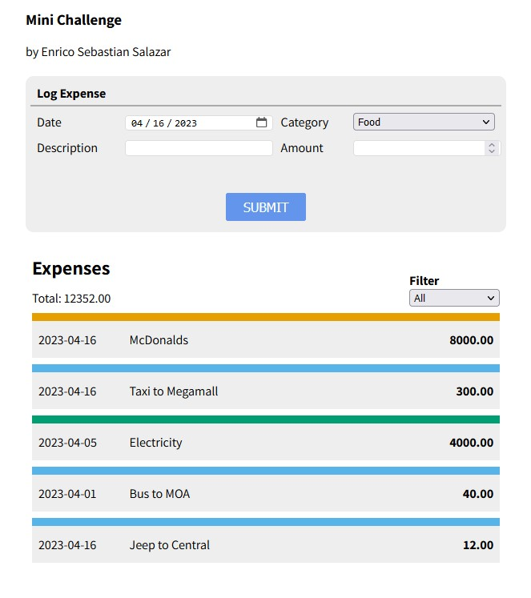

This is a repo of a challenge I did as part of my application. We needed to create a super quick and simple expense tracker.

Visit actual rendered site [here](https://enricosebastian.github.io/expense-tracker-challenge/)!

## How to install locally
1. Clone the repository
1. Run the `index.html` file on a localhost port.
1. Visit localhost url 

## Technologies used
[comment]: <this was taken from: https://home.aveek.io/GitHub-Profile-Badges/>

